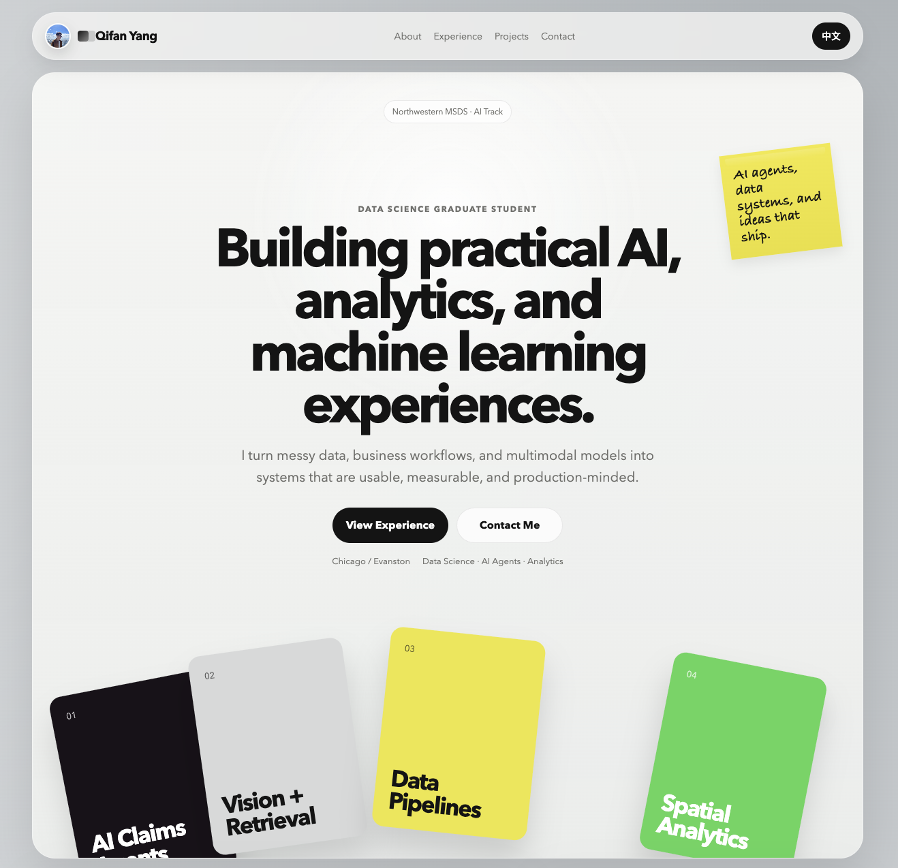

<div align="center">

# ✨ Qifan Yang — Personal Portfolio

**A bilingual static portfolio site built with zero dependencies.**

[](https://developer.mozilla.org/en-US/docs/Web/HTML)
[](https://developer.mozilla.org/en-US/docs/Web/CSS)
[](https://developer.mozilla.org/en-US/docs/Web/JavaScript)
[]()
[]()

[English](#-features) · [中文](#中文版)

</div>

---

## 📸 Preview

<!-- > Add a screenshot here: place an image at `assets/images/preview.png` and uncomment the line below. -->



---

## ⚡ Features

| Feature | Description |
|---------|-------------|
| 🌐 **Bilingual** | Real-time English / Chinese toggle with 485+ translation keys — no page reload needed |
| 🪶 **Zero Dependencies** | Pure HTML + CSS + JS, no framework, no build step, no `node_modules` |
| 🧊 **Glassmorphism Design** | Frosted-glass header, radial gradients, floating cards, and layered shadows |
| 📱 **Fully Responsive** | Mobile-first layout with breakpoints at 760px and 980px, `clamp()` fluid typography |
| 🎨 **Custom SVG Icons** | Hand-crafted icons for hobbies — violin, basketball, F1, history |
| 🔄 **Cache-Busting** | Version query strings on all static assets for safe redeployment |
| 📄 **Custom 404 Page** | Branded error page for broken links |

---

## 🛠️ Tech Stack

| Layer | Technology |
|-------|------------|
| Markup | HTML5 with semantic tags, ARIA labels, `data-i18n` attributes |
| Styling | CSS3 — CSS Grid, Flexbox, custom properties, `backdrop-filter`, gradients |
| Logic | Vanilla JavaScript — i18n engine, DOM manipulation, event listeners |
| Fonts | Avenir Next, SF Pro Display, PingFang SC |
| Deployment | Any static host (GitHub Pages, Vercel, Netlify, Alibaba OSS, Tencent COS) |

---

## 📑 Site Sections

| Section | What's Inside |
|---------|---------------|
| 🏠 **Hero** | Welcome panel with floating skill chips, stacked focus-area cards, and a handwritten sticky note |
| 👤 **About** | Profile photo, bio, and key stats — 1M+ images processed, 850K+ records cleaned, 30% review time reduced |
| 🎓 **Education** | Northwestern University (MSDS, AI Track) & UC Davis (B.S. Statistics) with skill chips |
| 💼 **Experience** | Vertical timeline — Bosch China ADAS · Bosch Powertrain · Uber Operations |
| 🔬 **Research** | DETR object detection study & 3D occupancy perception for autonomous driving |
| 🚀 **Projects** | RxPal mini-program · LLM multi-agent claims system · Chicago crime viz · DS/ML modeling |
| 🎵 **Interests** | Violin, Basketball, History, Formula 1 — each with custom SVG art |
| 📬 **Contact** | Email, WeChat, location |

---

## 🚀 Featured Projects

### RxPal WeChat Mini-Program
> Elderly health management app built with **Taro 4 + React 18 + TypeScript + Zustand + Tencent OCR**.

### LLM Multi-Agent Insurance Claims
> Intelligent claims processing system powered by **LangGraph + LangChain + OpenAI** with multi-agent orchestration.

### Chicago Crime Data Visualization
> Interactive geospatial analysis using **PostgreSQL + Folium + GeoJSON** mapping 7M+ crime records.

### DETR & 3D Occupancy Perception
> Deep learning research on transformer-based object detection and autonomous driving perception.

---

## 📂 Project Structure

```text
personal-site/
├── index.html              # Main page (530 lines)
├── styles.css              # All styles (1,100+ lines)
├── script.js               # i18n engine & interactions (410+ lines)
├── 404.html                # Custom error page
├── README.md
├── .gitignore
└── assets/
    ├── icons/
    │   ├── favicon.svg
    │   ├── icon-basketball.svg
    │   ├── icon-f1.svg
    │   ├── icon-history.svg
    │   └── icon-violin.svg
    └── images/
        ├── IMG_0901.jpg          # Profile photo
        ├── northwestern_logo.png
        ├── ucdavis_logo.png
        ├── bosch_logo.jpg
        ├── uber_logo.jpg
        ├── object_detection.png
        ├── occupancy.png
        ├── chicago_crime.png
        ├── chicago_crime_2.png
        ├── rxpal.jpg
        ├── rxpal_2.jpg
        └── rxpal_4.jpg
```

---

## 🏃 Getting Started

```bash
# Clone the repository
git clone https://github.com/QifanYang17/personal-site.git
cd personal-site

# Start a local server (Python 3)
python3 -m http.server 8000
```

Then open [http://localhost:8000](http://localhost:8000).

> No `npm install`, no build step — just open and go.

---

## 🌍 Deployment

| Platform | Notes |
|----------|-------|
| **GitHub Pages** | Push to `main`, enable Pages in repo settings |
| **Vercel / Netlify** | Connect repo, zero config needed |
| **Alibaba Cloud OSS** | Recommended for mainland China access (requires ICP filing) |
| **Tencent Cloud COS** | Alternative for mainland China |

**Cache-busting tip:** When updating `styles.css`, `script.js`, or images, bump the `?v=` query strings in `index.html` to avoid stale browser caches.

---

## 📝 Commit Conventions

| Scope | Usage |
|-------|-------|
| `content:` | Resume, project, or translation updates |
| `design:` | Layout and visual changes |
| `fix:` | Bug fixes |
| `deploy:` | Hosting, asset path, or cache-busting changes |

---

<a id="中文版"></a>
<div align="center">

# ✨ 杨启帆 — 个人作品集网站

**零依赖、中英双语的静态个人主页**

[](https://developer.mozilla.org/en-US/docs/Web/HTML)
[](https://developer.mozilla.org/en-US/docs/Web/CSS)
[](https://developer.mozilla.org/en-US/docs/Web/JavaScript)
[]()
[]()

</div>

---

## ⚡ 特性

| 特性 | 说明 |
|------|------|
| 🌐 **中英双语** | 实时中英文切换，485+ 个翻译键值，无需刷新页面 |
| 🪶 **零依赖** | 纯 HTML + CSS + JS，无框架、无构建步骤、无 `node_modules` |
| 🧊 **毛玻璃设计** | 磨砂玻璃导航栏、径向渐变、浮动卡片与层叠阴影 |
| 📱 **完全响应式** | 移动优先布局，760px / 980px 断点适配，`clamp()` 流式字体 |
| 🎨 **自制 SVG 图标** | 为兴趣爱好手工绘制的图标 — 小提琴、篮球、F1、历史 |
| 🔄 **缓存清除** | 静态资源使用版本号查询字符串，确保部署后即时更新 |
| 📄 **自定义 404 页面** | 品牌化错误页面 |

---

## 🛠️ 技术栈

| 层级 | 技术 |
|------|------|
| 标记语言 | HTML5 语义标签、ARIA 无障碍标注、`data-i18n` 属性 |
| 样式 | CSS3 — Grid 布局、Flexbox、自定义属性、`backdrop-filter`、渐变 |
| 逻辑 | 原生 JavaScript — i18n 引擎、DOM 操作、事件监听 |
| 字体 | Avenir Next、SF Pro Display、苹方、冬青黑体 |
| 部署 | 任意静态托管（GitHub Pages、Vercel、Netlify、阿里云 OSS、腾讯云 COS） |

---

## 📑 网站板块

| 板块 | 内容 |
|------|------|
| 🏠 **首屏** | 欢迎面板，浮动技能标签、堆叠方向卡片、手写风格便签 |
| 👤 **关于** | 个人照片、简介、核心数据 — 处理 100 万+ 图像、清洗 85 万+ 条数据、减少 30% 人工审核时间 |
| 🎓 **教育** | 西北大学（数据科学硕士，AI 方向）& 加州大学戴维斯分校（统计学学士） |
| 💼 **经历** | 纵向时间轴 — 博世中国 ADAS · 博世动力总成 · Uber 运营 |
| 🔬 **研究** | DETR 目标检测研究 & 自动驾驶 3D 占据感知 |
| 🚀 **项目** | RxPal 药品管理小程序 · LLM 多智能体理赔系统 · 芝加哥犯罪可视化 · 数据科学建模 |
| 🎵 **兴趣** | 小提琴、篮球、历史、F1 赛车 — 每项配有自制 SVG 插画 |
| 📬 **联系** | 邮箱、微信、所在地 |

---

## 🚀 亮点项目

### RxPal 微信小程序
> 面向老年人的健康管理应用，使用 **Taro 4 + React 18 + TypeScript + Zustand + 腾讯 OCR** 构建。

### LLM 多智能体保险理赔系统
> 智能理赔处理系统，基于 **LangGraph + LangChain + OpenAI** 的多智能体协作架构。

### 芝加哥犯罪数据可视化
> 使用 **PostgreSQL + Folium + GeoJSON** 对 700 万+ 犯罪记录进行交互式地理空间分析。

### DETR & 3D 占据感知研究
> 基于 Transformer 的目标检测与自动驾驶感知方向的深度学习研究。

---

## 📂 项目结构

```text
personal-site/
├── index.html              # 主页面（530 行）
├── styles.css              # 全部样式（1,100+ 行）
├── script.js               # i18n 引擎与交互逻辑（410+ 行）
├── 404.html                # 自定义错误页
├── README.md
├── .gitignore
└── assets/
    ├── icons/              # 自制 SVG 图标
    └── images/             # 头像、Logo、项目截图等
```

---

## 🏃 本地运行

```bash
# 克隆仓库
git clone https://github.com/QifanYang17/personal-site.git
cd personal-site

# 启动本地服务器（Python 3）
python3 -m http.server 8000
```

然后打开 [http://localhost:8000](http://localhost:8000)。

> 无需 `npm install`，无需构建 — 开箱即用。

---

## 🌍 部署

| 平台 | 备注 |
|------|------|
| **GitHub Pages** | 推送至 `main` 分支，在仓库设置中开启 Pages |
| **Vercel / Netlify** | 连接仓库，零配置部署 |
| **阿里云 OSS** | 推荐用于中国大陆访问（需 ICP 备案） |
| **腾讯云 COS** | 中国大陆部署备选方案 |

**缓存提示：** 更新 `styles.css`、`script.js` 或图片后，请同步更新 `index.html` 中的 `?v=` 版本号查询参数，避免浏览器缓存过期内容。

---

<div align="center">

Made with ❤️ by Qifan Yang

</div>
